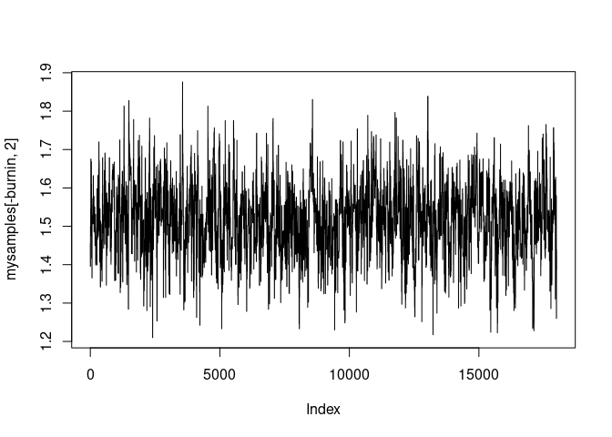
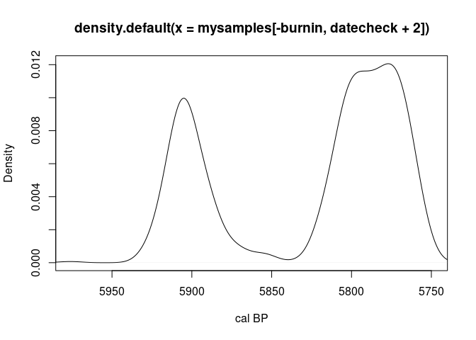
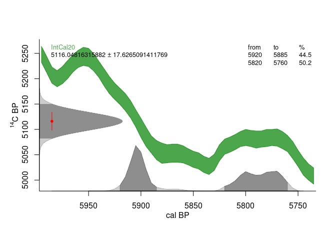

<!-- README.md is generated from README.Rmd. Please edit that file -->
# recm

<!-- badges: start -->
<!-- badges: end -->
The R::recm package provides tools for estimating parameters for Radiocarbon-dated Event Count (REC) Models. REC models are count-based regression models that account for radiocarbon-dating uncertainty in event times. They can be used in cases where abundances of radiocarbon dates are used as a proxy for some process that occurred in the past. Like any regression model, covariates are used to test hypotheses about potential causal relationships between processes represented by those variables and through-time variation in radiocarbon-dated sample abundances. Unlike previously developed REC model packages, this package employs an 'end-to-end' Bayesian framework, which means that the likelihoods of individual event times (given radiocarbon measurement and calibration uncertainties) are included explicitly in the likelihood for the model.

For now, the recm package only includes a simple Poisson REC model. It includes no autocorrelation terms and accounts only for radiocarbon-dating uncertainty in the dependent variable. It does not account for chronological or other uncertainty in the included independent variables. In time, the package will be extended to include covariate uncertainties (both chronological and measurement) and more complicated count-based time-series regression models.

## Installation

<!-- not on CRAN yet
You can install the released version of recm from [CRAN](https://CRAN.R-project.org) with:

``` r
install.packages("recm")
```
-->
You can install the development version from [GitHub](https://github.com/) with:

``` r
# install.packages("devtools")
devtools::install_github("wccarleton/recmod")
```

## Example

To demonstrate the basic use of this package, we can simulate some data from a hypothetical process and try to estimate a pre-determined target regression coefficient. Rather than just using purely simulated abstract data and processes, though, we can frame the problem in a way that is close to a real palaeo data science analysis.

Imagine a set of true event times (in calendar years BP) generated from a process dependent on climate change. The event times could represent, for example, archaeological site occupation dates, or burials, or carbon deposition in wetlands from marine ingression, and our data will be a set of relevant radiocarbon dates. Our simulated data will come from a statistical model (process model) that assumes through-time fluctuations in the abundance of radiocarbon samples is dependent on regional climate changes as indicated by a relevant palaeoclimate reconstruction. But, importantly, the relationship will not be deterministic. The number of samples per time period will be a random count variable with a distribution conditional on corresponding variation in climate. So, denoting the sample count at a given time by *y*<sub>*t*</sub> and assuming a Poisson distribution (*P**o**i**s*(⋅)),

*y*<sub>*t*</sub> ∼ *P**o**i**s*(*x*<sub>*t*</sub>*β*)
,

where *x*<sub>*t*</sub>*β* is a regression term that can include an intercept and an arbitrary number of covariates. In the regression part of the model, *x*<sub>*t*</sub> is a vector containing an intercept and the value of the palaeoclimate proxy at time *t* (or values for multiple covariates) and *β* is a vector containing regression coefficients, including one for the intercept. In our example, the main regression coefficient indicates the strength and direction of the effect of climate on the abundance of radiocarbon samples. Whatever value we set *β*<sub>1</sub> to while simulating the data below will become the target for our estimation with a REC model.

For the climate change process, we can use a real climate reconstruction from the [NOAA data warehouse](https://www.ncei.noaa.gov/access/paleo-search/). For the example below, I've downloaded and prepared a [pollen-based palaeo temperature reconstruction](https://www.ncei.noaa.gov/pub/data/paleo/pollen/recons/northamerica/viau2006namerica-temp.txt) for North America originally published by Viau et al. (2006). The prepared data are available with this package. They are a time series of temperature deviations sampled centennially and they are thought to reflect century-scale variation in temperature for North America from 6900 BP to 100 BP---at least these are the temporal characteristics of the specific time-series I extracted and prepared from the published, much larger dataset. This time-series will be used as the *x* in the process model to produce a sample of plausible event times from the stochastic climate--radiocarbon-abundance process.

In order to simulate some data from the process, we need to set a few parameters. These include start and end times (any palaeo data science analysis involves setting bounds on time and space, of course) and an effective temporal resolution (also practically always necessary). For this simulated example, we can just select some arbitrary interval that covers the time spanned by the climate data and use the climate dataset's existing temporal resolution (centennial). These temporal parameters establish a time-series grid that REC models (like any count-based time-series model) needs in order to pair dependent and independent variable measurements. The recm package will take the time grid as an argument as well (`t_edges`), so we need to prepare it in advance anyway.

It is important to ensure that the temporal grid and the covariates are running in the same temporal direction (either with time increasing into the past or toward the present). So, below, I've arranged the grid and the climate reconstruction so that time is moving from left-to-right (for the grid) and top-to-bottom for the `X` matrix. Age, though, will be decreasing because the calendar is in years BP, so the `t_grid` vector will containing a series of decreasing values. If this order is confused (e.g., the time direction of `t_grid` and the sequence of values in `x` are reversed relative to one another) the regression coefficient(s) in a REC model would have the wrong sign.

The other two key parameters, of course, are the regression coefficients for the intercept and climate covariate, *β*<sub>0</sub>, *β*<sub>1</sub> (b0 and b1, respectively). Note that the `X` matrix below has as its first column a vector of 1's. This column represents the intercept for the model and should probably always be included. The second column contains the temperature reconstruction time-series (scaled and centered).

``` r
library(recm)

t_start <- 6500
t_end <- 2000

indeces <- which(viau2006$AgeBP <= t_start & viau2006$AgeBP > t_end)

t_N <- length(indeces)

X <- cbind(rep(1, t_N), rev(scale(viau2006[indeces, "Temperature"])))

t_mids <- rev(viau2006[indeces, "AgeBP"])

t_edges <- c(t_mids + 50, t_mids[t_N] - 50)

b0 <- 0.5

b1 <- 1.5
```

With these initial settings, we need to simulate a sample of true event times. This can be done in different ways, but since we are assuming a stochastic relationship between climate and sample abundance, we will use random samples from a Poisson process model. A Poisson process, though, produces counts, not event times. In order to turn counts into event times, we just take the count for a given temporal bin and sample uniformly from the span of time covered by the bin in order to produce a sample of event times. There are reasons to prefer this approach to the alternate method frequently used to simulate dates---one that assumes the process is a one-dimensional density on the time-domain and samples directly from that---but that discussion is beyond the scope of this README and results will be similar either way, at least in small simulations like this.

``` r
library(IntCal)

event_counts <- rpois(n = t_N, lambda = exp(b0 + b1 * X[,2]))

event_times <- c()

for(j in 1:length(event_counts)){
    time_sample <- runif(n = event_counts[j],
                        min = t_mids[j] - 50,
                        max = t_mids[j] + 50)
    event_times <- c(event_times, time_sample)
}
```

With a simulated set of "true" event-times, we now need a plausible set of corresponding radiocarbon determinations. IntCal provides a function for getting realistic simulated uncalibrated radiocarbon dates from a set of true calendar dates.

``` r
library(IntCal)

dates <- do.call(rbind, lapply(event_times, IntCal::calBP.14C))
```

We can now run a REC model analysis in an attempt to reconstruct the true growth rate for the exponential process (1.5, from above). The `recm::recm()` function runs a [Metropolis-Hastings MCMC](https://en.wikipedia.org/wiki/Metropolis%E2%80%93Hastings_algorithm) to sample the Poisson regression model's posterior distribution. The simulation takes several arguments. The key ones to note here are

-   *niter*, which determines the number of iterations the MCMC is run for;
-   *adapt*, which is a logical (T or F) that determines whether the engage an adaptive algorithm for finding optimal proposal distribution scales for the main regression parameters (i.e., excluding the scales for proposal distributions pertaining to the event times);
-   *adapt\_amount*, *adapt\_interval*, and *adapt\_window*, which are all related to the adaptive algorithm;
-   *scales*, which is a vector of starting values for the proposal distribution scales for the main regression parameter.

Unlike some other regression functions, the dependent variable is passed into `recm()` as a matrix of radiocarbon dates (the ones we simulated) and the covariates are passed in as the `X` matrix (the real palaeoclimate time-series we used to simulate event times). The third parameter is a vector of temporal bin edges that define a temporal grid for the analysis (also produced earlier).

The `recm()` function should in most cases be called the first time with `adapt = T` in order to find good values for proposal distribution scales. It will return a list including `$scales`, which will be a matrix of scale values that have been adapted throughout the simulation.

``` r
mysamples_adapt <- recm(dates,
                    X,
                    t_edges,
                    niter = 2000,
                    adapt = T,
                    adapt_amount = 0.1,
                    adapt_interval = 20,
                    adapt_window = c(0.21, 0.25),
                    scales = c(0.1, 0.01))
#> No starting values provided ('startvals == NULL'). Using defaults.
#> No calibration curve provided. Using IntCal.
#> Determining calibrated date ranges...
#> Running MCMC...

burnin = 1:floor(dim(mysamples_adapt$scales)[1] * 0.25)

newscales <- colMeans(mysamples_adapt$scales[-burnin, ])
```

After removing some burn-in, we can then take an average of the scales tried by the adaptive algorithm and pass those as the `scales` argument to the `recm()` function with `adapt = F`. In this case, the scales refer to the proposal distributions for the two regression coefficients in the model, b0 and b1. The scales tried by the MCMC are returned in a matrix (`$scales`) where the columns are ordered in a way that mirrors the ordering of columns in the `X` matrix---so `$scales[1]` refers to the intercept and `$scales[1]` refers to the climate covariate regression coefficient. The same ordering occurs in the MCMC samples matrix (`$samples`) but that matrix also contains a column for the posterior samples for event times corresponding to each radiocarbon date and they are ordered following the descending order of events in `dates`.

``` r
mysamples <- recm(dates,
                X,
                t_edges,
                niter = 5000,
                adapt = F,
                scales = newscales)
#> No starting values provided ('startvals == NULL'). Using defaults.
#> No calibration curve provided. Using IntCal.
#> Determining calibrated date ranges...
#> Running MCMC...
```

The second run returned only the MCMC chains as a matrix with the first columns containing samples for the posteriors of the regression coefficients (two in this case corresponding to the two columns of the `X` matrix). The remaining columns contain samples of the event times, which will be samples from the calibrated date distributions---these are ordered the same as the radiocarbon dates in the matrix passed as the `dates` argument. These MCMC samples can then be plotted in order to check for mixing/convergence and then used to estimate posterior distributions and perform inference. As the plots below show, b1 was recovered (is within the 95% credible region) by the REC model MCMC.

### MCMC Chain for target regression coefficient



### Density estimate for posterior of target regression coefficient


We can also take a look at the posteriors for the calibrated radiocarbon dates. As mentioned, these are returned in the `$samples` matrix. They will be contained in the columns following the columns containing samples of the posteriors for the regression coefficients and ordered following the top-to-bottom ordering of the corresponding radiocarbon dates in the `dates` matrix. So, for example, we can plot the calibrated date density for the first event (which is contained in the 3rd column because it follows the column for two regression coefficients),

``` r
datecheck <- 1
plot(density(mysamples[-burnin, datecheck + 2]),
    xlab = "cal BP",
    xlim = rev(range(mysamples[-burnin, datecheck + 2])))
```



And, then, compare that plot to the calibration plot produced by IntCal for the same event,

``` r
IntCal::calibrate(dates[datecheck, 1], dates[datecheck, 2])
```



Some differences between the two should be expected because of the low number of iterations used in call the `recm()` above. The overall model likelihood is also affecting which age samples are retained in each MCMC iteration, which can produce different posteriors for the calibrated date densities than an unconstrained calibration would. Effectively, information from the whole date sample is being used to estimate posteriors for all model parameters, including the regression coefficients and the estimates for the true ages of each event in the sample.

## Notes

In many real-world analyses, one or more covariates could have different temporal resolutions and sampling frequencies. Those predictor variables will need to be put onto the same temporal grid used to define the whole analysis (defined in the `recm()` function by the `t_edges` parameter). Be sure to prepare the `X` matrix accordingly. This could be as simple as taking a running average of the temperature reconstruction and sampling it at the midpoints of the grid bins to produce a sequence of temperature averages at the appropriate temporal resolution (e.g., decadal averages, or whatever is appropriate).

Of course, almost any potential covariate will have chronological and measurement uncertainties and the `recm()` function currently does not include those. Future updates will include options for representing covariate uncertainties ('errors-in-variables').

It is also worth highlighting that increasing the number of events/radiocarbon-dates will increase computation times and likely require longer MCMC runs (more iterations) to arrive at good estimates for model posteriors. When `adapt = T`, the `recm()` function returns a list that includes acceptance rates and scales along with posterior samples (MCMC chains) that can be used to help diagnose convergence problems.
